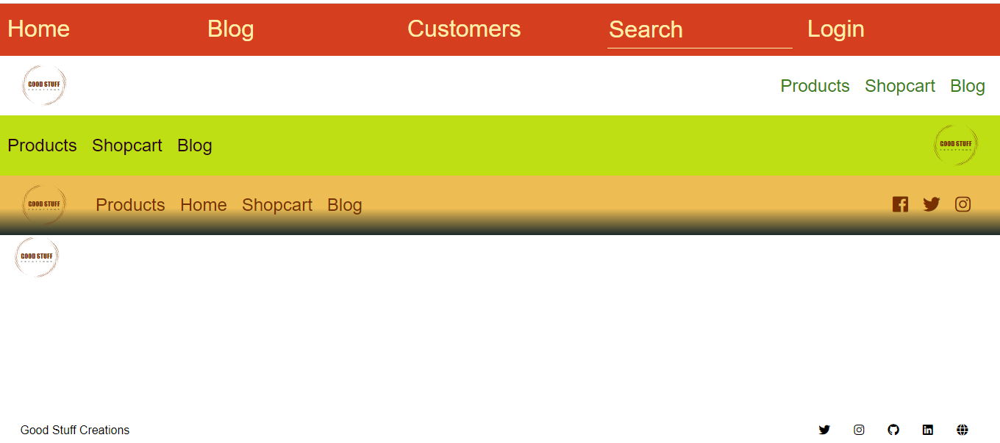

<h1 align="center"> 🔥Snippets🔥</h1>

<h2 align="center">A colection of snippets for you to use</h2>

### Index

- [Name](#Name) 👈
- [Links](#Links) 🔗
- [Description](#Description) 📖
- [Languages and Frameworks](####Languages-and-Frameworks) ⚙️
- [Screenshots](#Screenshots) 📱
- [Instalation](#Instalation) 🧩
- [Support](#Support) 🆘
- [Roadmap](#Roadmap) 🗺️
- [Authors and acknowledgment](####Authors-and-acknowledgment) ✍️
- [Project Status](#Project-Status) 📜

# Name

Good Stuff Creations

# Links

[Website](https://www.gscreations.io/coding)

---

# Description

Snippets for you to use in your project.All are responsive and optimized for acessibility.

---

# Languages, Frameworks and others

- **Flexbox**
- **Javascript**
- **Font Awesome** - Icons

---

# Screenshots

|           Home Page           |           Blog Page           |
| :---------------------------: | :---------------------------: |
|  |  |

---

# Instalation

---

# Support

Have any question or find something that doesn't look good? Let's talk 😊

[Here](https://github.com/mugas)

[And Here](https://www.gscreations.io/about)

---

# Roadmap

---

# Authors-and-acknowledgment

-

- ***

# Project-Status

Always improving
